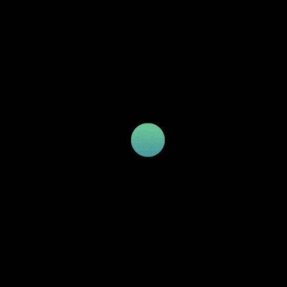

# BreatheView

Swift over Coffee [challenge](https://twitter.com/swiftovercoffee/status/1234417974137802754?s=21)

There are a couple things to make this more similar to Apple's animation but since the challenge had a one hour limit, this was the best I could do :)

- Add a fade animation on a second layer of items when collapsing;
- Add a blend mode on the layers (maybe [plusLighter](https://developer.apple.com/documentation/coregraphics/cgblendmode/pluslighter))

